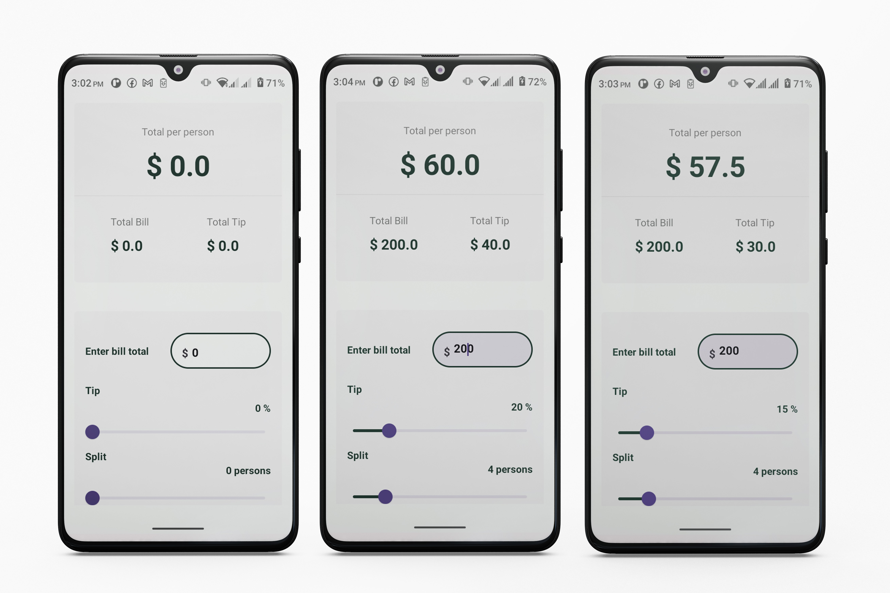
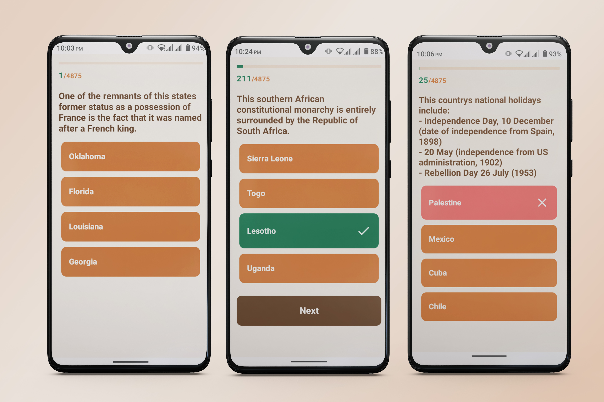

# Android Jetpack Compose: The Comprehensive Bootcamp Course

The pourpose of this repository is to show everything I have learn during the this course.

The course link click <a href="https://www.udemy.com/course/kotling-android-jetpack-compose-/?couponCode=KEEPLEARNING">here</a>

### Tip Calculator App
A Tip Calculator app Android development with Jetpack Compose. To learn about o Compose basic elements.

## Screenshots

    

### Movie App
A Movie app Android development with  Jetpack Compose and Build Modern App Interface. 
Learn some advaced comopsable elements and learn about navigation in Jetpack Compose.

## Screenshots

    

### Jet Trivia App
A a QUiz app Android development with Jetpack Compose. 
Learn about Dependence Injection with Hilt and some concepts : leverage Hilt and Dagger and add Dependency Injection into a Jetpack Compose Android App.
Use of Retroift to parse data, Coroutines and get remote data from api.

## Screenshots

    

